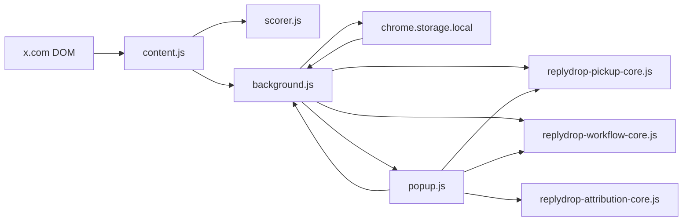

# Architecture

## 目标

ReplyDrop 试图把“发现值得回复的帖子”从一个纯视觉提示扩展成一个可持续复用的本地工作流：

1. 在时间线上发现候选
2. 给候选打分并解释理由
3. 为最值得处理的候选生成改写草稿
4. 把机会排入回复队列
5. 跟踪执行是否真的发生
6. 复查发出后的 pickup 表现
7. 把历史记忆再反馈给下一轮候选决策

## 运行时分层

### `content.js`

- 监听页面上的帖子流
- 提取 DOM 可见指标
- 调用 `scorer.js` 产出分数和 tier
- 注入帖子水滴角标
- 注入右上角悬浮水滴入口
- 和 `background.js` / `popup.js` 之间通过消息通讯同步状态

### `scorer.js`

- 只做帖子评分
- 基于 likes / replies / views / topic / language / media / crowding 等信号产出 VPS 分数

### `background.js`

- 持有单一状态源
- 负责 `chrome.storage.local` 持久化
- 归一化 `replyDetails`、`replyQueue`、`publishWatch`、`pickupWatch`
- 在“真实回复发生”时落地 shipped 记录
- 在 pickup snapshot 回来后更新 follow-up 状态

### `popup.js`

- 读取公开状态并渲染 UI
- 管理 popup 内的工作台、改写、队列和设置交互
- 发起对 `background.js` 的状态 patch

## 共享核心

为避免 `background.js` 和 `popup.js` 各自维护一份业务规则，当前把最容易漂移的纯逻辑抽成三个共享核心：

### `replydrop-pickup-core.js`

- pickup 状态归一：`pending / quiet / picked-up / author-engaged`
- review cadence 规划：第一次复查、follow-up、settled
- snapshot 结果解析

### `replydrop-workflow-core.js`

- reply queue 状态归一
- queue 排序
- publish-watch 有效状态推导
- publish-watch 生命周期统计

### `replydrop-attribution-core.js`

- handle / topic / lane attribution 聚合
- reviewed / settled / picked-up / author-engaged 权重
- 候选归因摘要
- 默认 queue slot 建议

这些共享核心都满足两个约束：

- 浏览器运行时可直接加载
- Node 测试可直接 `require()`

## 状态模型

核心状态保存在 `chrome.storage.local` 的 `x-reply-scorer-state` 下。

关键字段：

- `recentCandidates`: 最近可见的高价值候选
- `replyDetails`: 已真实回复过的帖子详情
- `replyQueue`: 待执行 / 已完成 / 已发出的排队项
- `publishWatch`: 已 handoff 给 composer，但还没有闭环确认的项
- `pickupWatch`: 已发出后，等待复查 pickup 的项
- `relationshipStates`: 针对 handle 的轻量 CRM 状态

## 数据流

## 开源维护原则

- 纯逻辑先抽到共享核心，再接入 UI
- 优先补测试覆盖最容易漂移的状态机
- 任何新状态都要先写归一化逻辑
- 发版 zip 只包含运行时必需文件
