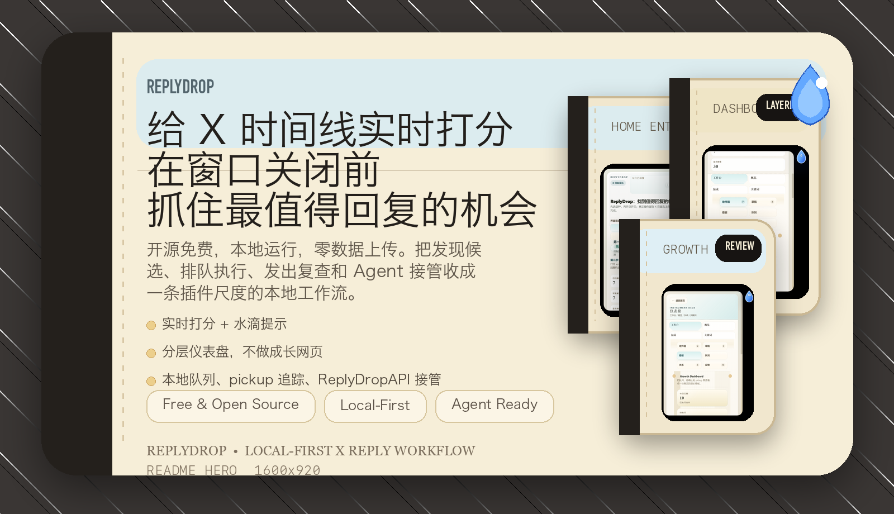
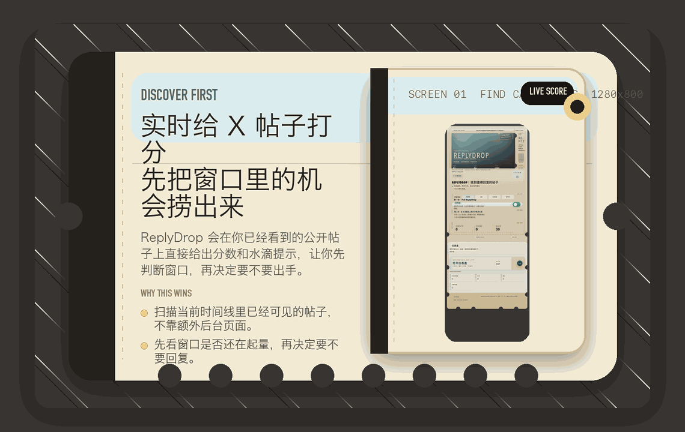
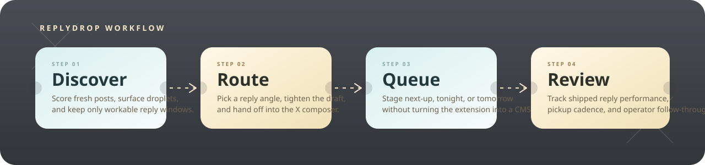
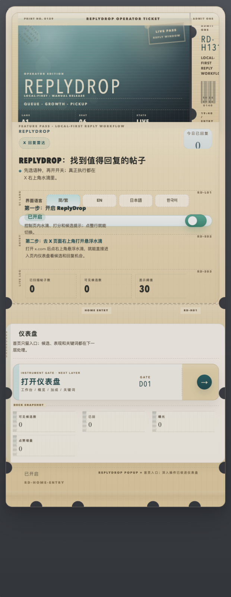
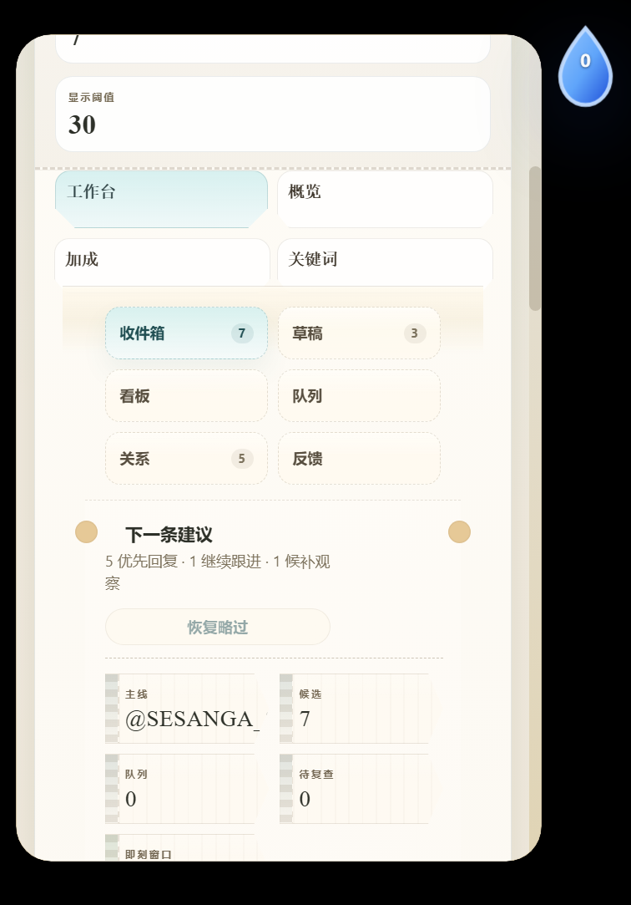
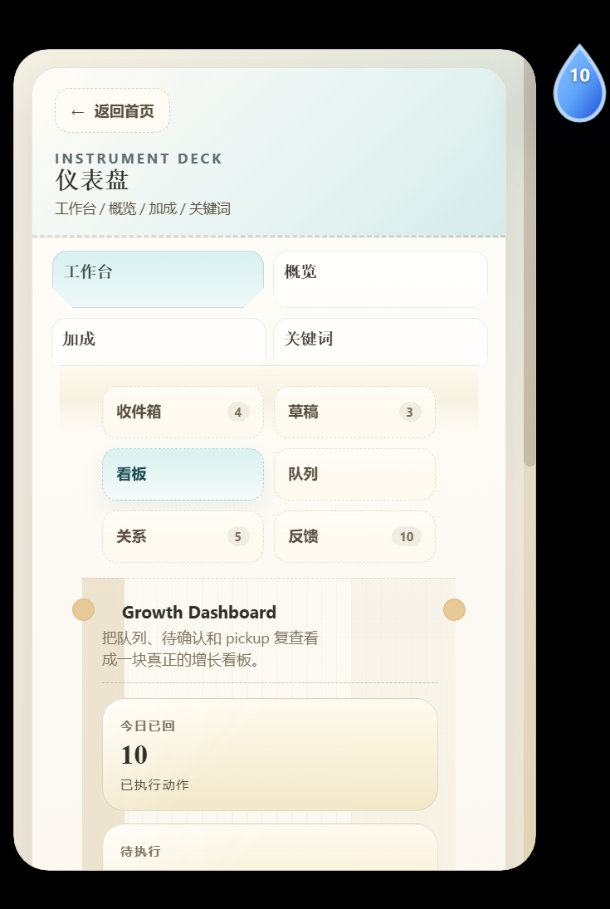

# ReplyDrop

语言：中文 | [English](./README.en.md)

ReplyDrop 是一个浏览器扩展，实时给你 X 时间线上的每条帖子打分，帮你在窗口关闭前找到最值得回复的机会。

开源免费，本地运行，零数据上传。

当前重置基线版本：`0.2.227`

这个仓库目标是把 ReplyDrop 打磨成一个够稳、够清晰、能接收社区贡献的开源版本。



<p align="center">
  <a href="./SMOKE-TEST.md">快速上手</a> ·
  <a href="./AUTOMATION.md">ReplyDropAPI</a> ·
  <a href="./docs/store/CHROME-WEB-STORE-LISTING.md">商店文案</a> ·
  <a href="./docs/store/CHROME-WEB-STORE-SUBMISSION.md">商店提交</a> ·
  <a href="./docs/store/CHROME-WEB-STORE-REVIEWER-NOTES.md">审核说明</a> ·
  <a href="./PRIVACY.md">隐私边界</a>
</p>

| 实时发现 | 本地闭环 | Executor Ready |
| --- | --- | --- |
| 为当前 X 时间线已经可见的帖子实时打分，并用水滴提示高价值回复窗口 | 回复队列、publish watch、pickup 复查都保留在浏览器本地，不依赖外部服务 | `window.ReplyDropExecutor` / `window.ReplyDropAPI` 支持 Codex / OpenClaw / Hermes / Claude 直接读 shortlist、上下文、媒体引用、排队、开框、提交与校验 |

## 你有竞品没有的

- 界面支持简体中文、繁體中文、English、日本語、한국어
- 回复语言加成覆盖中日韩英法西德意葡，匹配你的目标受众
- 主题关键词加成覆盖 `AI` / `Crypto` / `Creator` 等细分方向，并支持自定义关键词
- 完整的本地回复队列 + pickup 追踪，发出后自动复查互动结果
- `window.ReplyDropExecutor` / `window.ReplyDropAPI` 让外部执行器可通过 CDP 直接接管 shortlist、上下文打包、排队与执行闭环

不收钱，不上传数据，不依赖任何外部服务。

## 开源快照

- 当前定位：本地优先的 X 回复工作台，不是网页后台，也不是无人值守群发机器人
- 当前重点：稳定、分层 popup、ReplyWisely 风格工作流、电影票根视觉语言
- 当前边界：不接远端模型，不依赖服务端，不做后台无人值守批量自动发帖

## 文档地图

- 想先快速了解产品和安装：看 [README.md](./README.md)
- 想理解运行时边界和模块关系：看 [ARCHITECTURE.md](./ARCHITECTURE.md)
- 想接 Ada / CDP / bot 自动化：看 [AUTOMATION.md](./AUTOMATION.md)
- 想准备商店上架图标、截图和文案：看 [docs/store/CHROME-WEB-STORE-LISTING.md](./docs/store/CHROME-WEB-STORE-LISTING.md)
- 想直接照着填写商店提交表单：看 [docs/store/CHROME-WEB-STORE-SUBMISSION.md](./docs/store/CHROME-WEB-STORE-SUBMISSION.md)
- 想准备审核补充说明或权限答辩：看 [docs/store/CHROME-WEB-STORE-REVIEWER-NOTES.md](./docs/store/CHROME-WEB-STORE-REVIEWER-NOTES.md)
- 想手工回归 popup / 队列 / pickup：看 [SMOKE-TEST.md](./SMOKE-TEST.md)
- 想准备公开仓导出或正式打包：看 [OPEN-SOURCE-RELEASE.md](./OPEN-SOURCE-RELEASE.md) 和 [RELEASING.md](./RELEASING.md)
- 想参与协作：看 [CONTRIBUTING.md](./CONTRIBUTING.md)、[SUPPORT.md](./SUPPORT.md)、[SECURITY.md](./SECURITY.md)

## Demo

下面这个循环 demo 直接基于当前版本的真实界面与门面图整理，用来快速展示发现候选、语言加成、分层仪表盘、增长看板和 Agent 接口这五层产品面。



## 流程概览



## 当前界面截图

首页入口



仪表盘分层



增长看板



## 今天能做什么

- 扫描 `x.com` / `twitter.com` 当前可见帖子并本地打分
- 在回复按钮附近注入小型水滴角标，标识值得回复的帖子
- 用分层 popup 把首页入口和仪表盘拆开，并让 `工作台 / 概览 / 加成 / 关键词` 保持各自独立票区气质
- 支持 Reply Queue、Publish Watch、Pickup Watch、Attribution Memory
- 用 `Growth Pulse` 聚焦已发回复的表现，而不是只盯着抽象候选数

## 暂时不做什么

- 不做后台无人值守批量自动发布
- 不做远端账号系统
- 不做云端同步
- 不把 `AI执行台` 包装成内置模型能力
- 不把插件强行做成重后台或 CMS

## 当前能力

- 在 `x.com` / `twitter.com` 页面监听帖子流并计算本地分数
- 在回复按钮附近注入小型水滴角标，标识值得回复的帖子
- 支持语言 / 主题 / 关键词加成和仅显示命中项
- Popup 首页只保留入口与基础控制，点击 `仪表盘` 后进入 `工作台 / 概览 / 加成 / 关键词`
- popup 视觉继续沿 `电影票根 / 海报票面` 方向收束
  - 首页恢复更像票面的海报头、票号尾注和底部半圆切口
  - `打开仪表盘` 入口也改成更像撕口票根，而不是普通按钮
  - 仪表盘四个主页签现在也各自带有不同票区 tint、serial 和 header 气质
  - 视图切换、票区 hover / focus 和 tab 反馈也补上了更克制的微动势
  - 同时补上了 `prefers-reduced-motion`，避免把质感建立在强动画上
  - README 现在也带有一个轻量循环 demo，方便公开仓快速理解当前界面
  - 仪表盘里的增长卡、队列卡、关系卡和草稿卡也继续收成了更统一的票面排印体系
  - 高频阅读的候选票条和反馈票条也继续降躁，信息层级更稳定
  - section reveal 和工作台子页签导轨也继续收成了更克制的节奏层级
  - `概览 / 加成 / 关键词` 这些工具型面板也继续拉回同一套票面系统，少一点“设置页”感
  - 首页入口和仪表盘头部也继续补上真实的 divider rail、tear-stub cutout 和 serial，票根感不再只停留在配色
  - 首页 poster 现在也补上了侧边 stub、规格栏和更完整的正面票根排印
  - 整张票面的黑边、侧边切口和底部齿口也继续收拢到同一套边缘几何里
- 工作台当前收敛成 `看板 / AI执行` 两个二级面板
- `AI执行` 工作台支持：
  - 展示当前 top 6 shortlist，而不是只把 1 条候选包装成模板草稿
  - 输出单条候选上下文包：作者、关系、评分、推荐档位、媒体需求、隐藏 route hints
  - 输出 top shortlist inbox 和统一 reply schema，方便 agent 直接复制进 CDP / evaluate 流程
  - 从 shortlist 直接切焦点、入队、打开真实回复框
- `规则草稿台` 仍然保留：
  - 继续提供 3 条本地规则 fallback
  - 主要服务人工使用或无模型场景
  - 不再把这些规则文稿伪装成 AI 最终回复
- Reply Queue 支持 `下一轮 / 今晚 / 明早` 排期和已发出状态跟踪
- Publish Watch 跟踪“已拉起 composer 但未闭环”的执行项
- Pickup Watch 跟踪 shipped reply 是否被线程接住
- Attribution Memory 会把 handle / topic / lane 的历史表现反向喂给当前候选排序和默认排期
- 在 `x.com` 页面向 page world 暴露 `window.ReplyDropExecutor` 和兼容别名 `window.ReplyDropAPI`
  - 让 Codex / OpenClaw / Hermes / Claude / 其他自动化脚本直接读 shortlist、读候选上下文包、读队列、入队、拉起真实回复框、提交回复、标记发出、跳过候选
  - 不再依赖截图、DOM 找按钮或 popup 可见状态

## Automation API

ReplyDrop 现在会只在 `x.com` 域名下注入一个 page-world 全局对象：

```js
window.ReplyDropExecutor
```

兼容别名仍然保留：

```js
window.ReplyDropAPI
```

支持的方法：

```js
await window.ReplyDropExecutor.getCapabilities()
await window.ReplyDropExecutor.getCandidates()
await window.ReplyDropExecutor.getQueue()
await window.ReplyDropExecutor.getMediaBundle("2045354208548069468")
await window.ReplyDropExecutor.setMediaSummary({ tweetId: "2045354208548069468", summary: "visual summary", ocrText: "OCR text", confidence: 0.8 })
await window.ReplyDropExecutor.getTrafficSnapshot("2045354208548069468")
await window.ReplyDropExecutor.getDraftTargets({ limit: 6 })
await window.ReplyDropExecutor.getDraftContext("2045354208548069468")
await window.ReplyDropExecutor.setDraftPreview({ tweetId: "2045354208548069468", replyText: "your finished draft" })
await window.ReplyDropExecutor.refreshRecommendations({ mode: "scroll", pages: 2 })
await window.ReplyDropExecutor.getExecutorInbox({ limit: 6 })
await window.ReplyDropExecutor.getExecutorContext("2045354208548069468")
await window.ReplyDropExecutor.getExecutorSchema()
await window.ReplyDropExecutor.getState()
await window.ReplyDropExecutor.addToQueue("2045354208548069468")
await window.ReplyDropExecutor.openComposer({ tweetId: "2045354208548069468", draft: "your reply text" })
await window.ReplyDropExecutor.replyFromTimeline({ tweetId: "2045354208548069468", draft: "your reply text" })
await window.ReplyDropExecutor.submitReply({ autoLikeIfChinese: true })
await window.ReplyDropExecutor.runExecutorAction({ action: "reply", tweetId: "2045354208548069468", draft: "your reply text" })
await window.ReplyDropExecutor.markShipped("2045354208548069468", "your reply text")
await window.ReplyDropExecutor.skipCandidate("2045354208548069468")
```

- 深入说明见 [AUTOMATION.md](./AUTOMATION.md)
  - 方法返回字段
  - 错误语义
  - CDP evaluate 示例
  - `autoLikeIfChinese` 这类 agent 专用发送选项
  - `refreshRecommendations()` / `emptyInboxRecovery` 空候选重扫规则
  - 90 秒正常目标与 120 秒硬截止执行策略
  - 自动化限制与注意事项

- 一个最短的 CDP evaluate 示例：

```js
await page.evaluate(async () => {
  const executor = window.ReplyDropExecutor || window.ReplyDropAPI;
  const inbox = await executor.getExecutorInbox({ limit: 6 });
  if (!inbox.candidates.length) return null;
  const lead = inbox.candidates[0];
  return {
    lead,
    schema: await executor.getExecutorSchema()
  };
});
```

## 项目结构

- `/manifest.json`: 扩展声明
- `/background.js`: 后台状态管理、归一化、持久化、alarms
- `/content.js`: 页面内侦测、角标与悬浮入口注入
- `/replydrop-api-bridge.js`: page-world automation bridge，向 `x.com` 暴露 `window.ReplyDropExecutor` 和兼容别名 `window.ReplyDropAPI`
- `/popup.html` `/popup.css` `/popup.js`: popup UI 与交互
- `/replydrop-pickup-core.js`: pickup review 共享纯逻辑
- `/replydrop-workflow-core.js`: queue / publish-watch 共享纯逻辑
- `/replydrop-attribution-core.js`: attribution 共享纯逻辑
- `/replydrop-focus-core.js`: focus digest 与候选预览共享纯逻辑
- `/replydrop-draft-core.js`: draft angle 选择共享纯逻辑
- `/replydrop-queue-core.js`: queue 过滤与预览共享纯逻辑
- `/replydrop-feedback-core.js`: feedback 预览排序共享纯逻辑
- `/replydrop-popup-ui-core.js`: popup 分层导航与视图状态归一化纯逻辑
- `/replydrop-growth-core.js`: Growth Dashboard 聚合、复查 bucket 与执行压力纯逻辑
- `/tests`: Node 原生测试
- `/scripts`: 验证与打包脚本

更详细的模块关系见 [ARCHITECTURE.md](./ARCHITECTURE.md)。

## 工作流

1. 在 X 时间线上发现正在起速、值得回复的帖子
2. 进入票根式 popup / 仪表盘，收敛候选与下一步动作
3. 把目标放进 `下一轮 / 今晚 / 明早`
4. 在 `Growth Pulse` 和 pickup 复查看发出后的真实反馈

## 本地安装

1. 打开 Chrome / Brave 的扩展管理页：`chrome://extensions`
2. 打开右上角“开发者模式”
3. 点击“加载已解压的扩展程序”
4. 选择当前仓库根目录

## Local Install

1. Open `chrome://extensions` in Chrome or Brave.
2. Enable `Developer mode`.
3. Click `Load unpacked`.
4. Select this repository root.
5. Open `x.com` or `twitter.com`, then wait a few seconds for ReplyDrop to scan visible posts.

## 开发与验证

项目不依赖打包器，直接使用浏览器扩展运行时和 Node 自带工具。

```bash
cd <repo-dir>
node scripts/validate-release.mjs
```

可选快捷命令：

```bash
npm run check:syntax
npm run check:oss
npm run test
npm run check:doc-links
npm run validate
npm run package
npm run export:oss
```

公开仓清理导出流程见 [OPEN-SOURCE-RELEASE.md](./OPEN-SOURCE-RELEASE.md)。

## 开源协作边界

- 优先修稳定性、DOM 兼容性、状态一致性、测试和文档
- UI 可以继续精修，但不要把插件重新做成长网页
- 人工写稿模式是一次首页快照协作：`getDraftTargets()` 输出 `snapshotId/capturedAt/collaborationPolicy`，并给每个候选附带 `rank/domIndex/visibleOnPage/textPreview`，外部 AI 应在当前聊天窗口批量给草稿或不建议回原因，不得擅自刷新、排队或发送
- 图文、视频、引用卡、疑似展开全文的候选会带 `needsDetailContext/mediaContextMissing/draftContextLabel`，外部 AI 应标注 quick preview draft，并在打开详情页后重写
- 当 `mediaContextMissing=true` 时，agent 可用 `getMediaBundle()` 拿图片/视频 URL 或首帧，再用 `setMediaSummary()` 回填 OCR/vision 摘要，之后再生成更可靠草稿
- 高流速财富故事在人工预览模式下不应被 agent 仅因财富相邻自动跳过；应按 `aiHints.draftAngleHints` 写成中性观察，避免投资建议、买卖、价格预测和项目推广
- `AI执行台` 当前负责 runtime 输入与执行闭环，不负责假装内置模型写稿

## 发版产物

正式打包会读取 `scripts/runtime-files.txt`，只把扩展运行时必需文件写入 zip：

- `manifest.json`
- `background.js`
- `content.js`
- `scorer.js`
- `popup.html`
- `popup.css`
- `popup.js`
- `options.html`
- 这些共享核心文件

执行：

```bash
bash scripts/package-release.sh
```

当前会生成 `replydrop-p2.227.zip` 这样的安装包。

## 文档导航

- [ARCHITECTURE.md](./ARCHITECTURE.md)
- [PRIVACY.md](./PRIVACY.md)
- [SMOKE-TEST.md](./SMOKE-TEST.md)
- [OPEN-SOURCE-RELEASE.md](./OPEN-SOURCE-RELEASE.md)
- [RELEASING.md](./RELEASING.md)
- [ROADMAP.md](./ROADMAP.md)
- [CONTRIBUTING.md](./CONTRIBUTING.md)
- [SUPPORT.md](./SUPPORT.md)
- [SECURITY.md](./SECURITY.md)

## 隐私说明

- 当前版本纯本地运行，不依赖外部 API
- 扩展只读取当前 X 页面已渲染到浏览器里的公开信息
- 数据默认写在 `chrome.storage.local`
- 更完整说明见 [PRIVACY.md](./PRIVACY.md)

## 当前仍未完成

- 最终回复文稿仍需要外部模型 / agent 自己产出，ReplyDrop 当前负责 shortlist、上下文、记忆和执行闭环
- `AI执行台` 已经 runtime-ready，但还没有内置远端模型调用
- 增长 attribution 仍以本地可见信号为主，不是完整分析看板
- execute / publish 仍然是辅助闭环，不是全自动发布
