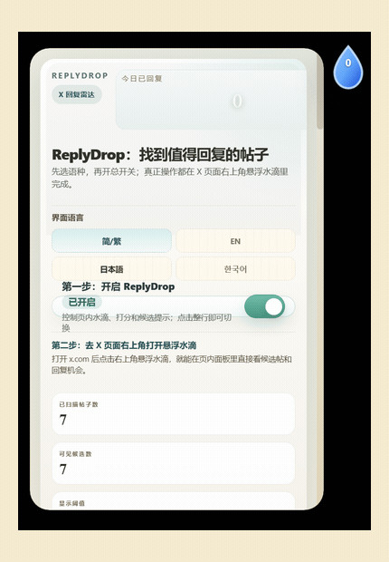

# ReplyDrop

ReplyDrop 是一个浏览器扩展，实时给你 X 时间线上的每条帖子打分，帮你在窗口关闭前找到最值得回复的机会。

开源免费，本地运行，零数据上传。

当前重置基线版本：`0.2.135`

这个仓库目标是把 ReplyDrop 打磨成一个够稳、够清晰、能接收社区贡献的开源版本。

## 你有竞品没有的

- 界面支持简体中文、繁體中文、English、日本語、한국어
- 回复语言加成覆盖中日韩英法西德意葡，匹配你的目标受众
- 主题关键词加成覆盖 `AI` / `Crypto` / `Creator` 等细分方向，并支持自定义关键词
- 完整的本地回复队列 + pickup 追踪，发出后自动复查互动结果
- `window.ReplyDropAPI` 让 AI Agent 可通过 CDP 直接接管候选筛选、排队、追踪全流程

不收钱，不上传数据，不依赖任何外部服务。

## 开源快照

- 当前定位：本地优先的 X 回复工作台，不是网页后台，也不是自动发帖机器人
- 当前重点：稳定、分层 popup、ReplyWisely 风格工作流、电影票根视觉语言
- 当前边界：不接远端模型，不依赖服务端，不自动点击发送

## 文档地图

- 想先快速了解产品和安装：看 [README.md](./README.md)
- 想理解运行时边界和模块关系：看 [ARCHITECTURE.md](./ARCHITECTURE.md)
- 想接 Ada / CDP / bot 自动化：看 [AUTOMATION.md](./AUTOMATION.md)
- 想准备商店上架图标、截图和文案：看 [docs/store/CHROME-WEB-STORE-LISTING.md](./docs/store/CHROME-WEB-STORE-LISTING.md)
- 想手工回归 popup / 队列 / pickup：看 [SMOKE-TEST.md](./SMOKE-TEST.md)
- 想准备公开仓导出或正式打包：看 [OPEN-SOURCE-RELEASE.md](./OPEN-SOURCE-RELEASE.md) 和 [RELEASING.md](./RELEASING.md)
- 想参与协作：看 [CONTRIBUTING.md](./CONTRIBUTING.md)、[SUPPORT.md](./SUPPORT.md)、[SECURITY.md](./SECURITY.md)

## 预览


## 轻量 Demo

下面这个循环 demo 基于当前版本的真实界面截图整理而成，用来快速展示首页入口、分层仪表盘和增长看板的整体观感。



## 当前界面截图

首页入口


仪表盘分层


增长看板


## 今天能做什么

- 扫描 `x.com` / `twitter.com` 当前可见帖子并本地打分
- 在回复按钮附近注入小型水滴角标，标识值得回复的帖子
- 用分层 popup 把首页入口和仪表盘拆开，并让 `工作台 / 概览 / 加成 / 关键词` 保持各自独立票区气质
- 支持 Reply Queue、Publish Watch、Pickup Watch、Attribution Memory
- 用 `Growth Pulse` 聚焦已发回复的表现，而不是只盯着抽象候选数

## 暂时不做什么

- 不做自动发布
- 不做远端账号系统
- 不做云端同步
- 不把 `AI回复` 包装成模型能力
- 不把插件强行做成重后台或 CMS

## 当前能力

- 在 `x.com` / `twitter.com` 页面监听帖子流并计算本地分数
- 在回复按钮附近注入小型水滴角标，标识值得回复的帖子
- 支持语言 / 主题 / 关键词加成和仅显示命中项
- Popup 首页只保留入口与基础控制，点击 `仪表盘` 后进入 `工作台 / 概览 / 加成 / 关键词`
- popup 视觉继续沿 `电影票根 / 海报票面` 方向收束
  - 首页恢复更像票面的海报头、票号尾注和底部半圆切口
  - `打开仪表盘` 入口也改成更像撕口票根，而不是普通按钮
  - 仪表盘四个主页签现在也各自带有不同票区 tint、serial 和 header 气质
  - 视图切换、票区 hover / focus 和 tab 反馈也补上了更克制的微动势
  - 同时补上了 `prefers-reduced-motion`，避免把质感建立在强动画上
  - README 现在也带有一个轻量循环 demo，方便公开仓快速理解当前界面
  - 仪表盘里的增长卡、队列卡、关系卡和草稿卡也继续收成了更统一的票面排印体系
  - 高频阅读的候选票条和反馈票条也继续降躁，信息层级更稳定
  - section reveal 和工作台子页签导轨也继续收成了更克制的节奏层级
  - `概览 / 加成 / 关键词` 这些工具型面板也继续拉回同一套票面系统，少一点“设置页”感
  - 首页入口和仪表盘头部也继续补上真实的 divider rail、tear-stub cutout 和 serial，票根感不再只停留在配色
  - 首页 poster 现在也补上了侧边 stub、规格栏和更完整的正面票根排印
  - 整张票面的黑边、侧边切口和底部齿口也继续收拢到同一套边缘几何里
- 工作台当前收敛成 `看板 / AI回复` 两个二级面板
- `AI回复` 工作台支持：
  - 一键式 `出手路数`
  - 基于 `pickup / reviewed / lane / 拥挤度 / score` 的路数推荐
  - 不同路数的主草稿正文会明显切成不同说话方式，而不是只换几个近义词
  - 同一路数的 `起手 / 推进 / 收尾` 也会根据窗口与记忆信号自动换包，不再是固定索引
  - 路数卡会直接展示本次将采用的打法摘要
  - 路数选中后的最终工作稿会按该 bundle 的节奏收束成更统一的 2-3 句，而不是机械把 3 段说明拼起来
  - route 生效时第一句会直接改成该打法自己的主句，减少“我会怎么回”这类解释腔
  - route 生效后的第二句和收尾也会优先改成该打法自己的表达，而不是回退成通用说明句
  - route 稿里最明显的一批模板化词句已经做了一轮去模板味收敛
  - route 稿里又做了一轮中文去模板味，把更像“系统在讲打法”的句子继续压回更自然的回复口吻
  - route 推荐现在会区分“真的被接住的记忆”和“只是复查过但还偏安静的记忆”，避免把 quiet reviewed 误判成已验证主线
  - fresh 候选的 route 推荐现在会更偏“独特主意 / 补一层”
    - 对发出约 1 小时内、已经起量、还在加速、回复区仍有空间的帖子
    - 更优先给 `直接给观点 / 先补一层`
    - 少一点泛态度，更多实质观点或新增信息
  - 当前工作稿新增 `收成直发版`
    - 会把偏说明味的工作稿压成更短、更像直接回复的版本
    - 再决定复制 / 排队 / 打开回复框
  - 改写工作台现在可以直接把当前工作稿带到 X 的回复框，不用先手动复制再找 composer
  - 候选前三顺位决策板
  - 强起手 / 往下推进 / 收尾动作 三段式改写
  - 从优先级板直接切焦点或按建议档位入队
- Reply Queue 支持 `下一轮 / 今晚 / 明早` 排期和已发出状态跟踪
- Publish Watch 跟踪“已拉起 composer 但未闭环”的执行项
- Pickup Watch 跟踪 shipped reply 是否被线程接住
- Attribution Memory 会把 handle / topic / lane 的历史表现反向喂给当前候选排序和默认排期
- 在 `x.com` 页面向 page world 暴露 `window.ReplyDropAPI`
  - 让 Ada / CDP / 其他自动化脚本直接读候选、读队列、入队、标记发出、跳过候选
  - 不再依赖截图、DOM 找按钮或 popup 可见状态

## Automation API

ReplyDrop 现在会只在 `x.com` 域名下注入一个 page-world 全局对象：

```js
window.ReplyDropAPI
```

支持的方法：

```js
await window.ReplyDropAPI.getCandidates()
await window.ReplyDropAPI.getQueue()
await window.ReplyDropAPI.getState()
await window.ReplyDropAPI.addToQueue("2045354208548069468")
await window.ReplyDropAPI.markShipped("2045354208548069468", "your reply text")
await window.ReplyDropAPI.skipCandidate("2045354208548069468")
```

- 深入说明见 [AUTOMATION.md](./AUTOMATION.md)
  - 方法返回字段
  - 错误语义
  - CDP evaluate 示例
  - 自动化限制与注意事项

- 一个最短的 CDP evaluate 示例：

```js
await page.evaluate(async () => {
  const candidates = await window.ReplyDropAPI.getCandidates();
  if (!candidates.length) return null;
  const lead = candidates[0];
  await window.ReplyDropAPI.addToQueue(lead.tweetId);
  return await window.ReplyDropAPI.getQueue();
});
```

## 项目结构

- `/manifest.json`: 扩展声明
- `/background.js`: 后台状态管理、归一化、持久化、alarms
- `/content.js`: 页面内侦测、角标与悬浮入口注入
- `/replydrop-api-bridge.js`: page-world automation bridge，向 `x.com` 暴露 `window.ReplyDropAPI`
- `/popup.html` `/popup.css` `/popup.js`: popup UI 与交互
- `/replydrop-pickup-core.js`: pickup review 共享纯逻辑
- `/replydrop-workflow-core.js`: queue / publish-watch 共享纯逻辑
- `/replydrop-attribution-core.js`: attribution 共享纯逻辑
- `/replydrop-focus-core.js`: focus digest 与候选预览共享纯逻辑
- `/replydrop-draft-core.js`: draft angle 选择共享纯逻辑
- `/replydrop-queue-core.js`: queue 过滤与预览共享纯逻辑
- `/replydrop-feedback-core.js`: feedback 预览排序共享纯逻辑
- `/replydrop-popup-ui-core.js`: popup 分层导航与视图状态归一化纯逻辑
- `/replydrop-growth-core.js`: Growth Dashboard 聚合、复查 bucket 与执行压力纯逻辑
- `/tests`: Node 原生测试
- `/scripts`: 验证与打包脚本

更详细的模块关系见 [ARCHITECTURE.md](./ARCHITECTURE.md)。

## 工作流

1. 在 X 时间线上发现正在起速、值得回复的帖子
2. 进入票根式 popup / 仪表盘，收敛候选与下一步动作
3. 把目标放进 `下一轮 / 今晚 / 明早`
4. 在 `Growth Pulse` 和 pickup 复查看发出后的真实反馈

## 本地安装

1. 打开 Chrome / Brave 的扩展管理页：`chrome://extensions`
2. 打开右上角“开发者模式”
3. 点击“加载已解压的扩展程序”
4. 选择当前仓库根目录

## 开发与验证

项目不依赖打包器，直接使用浏览器扩展运行时和 Node 自带工具。

```bash
cd <repo-dir>
node scripts/validate-release.mjs
```

可选快捷命令：

```bash
npm run check:syntax
npm run check:oss
npm run test
npm run check:doc-links
npm run validate
npm run package
npm run export:oss
```

公开仓清理导出流程见 [OPEN-SOURCE-RELEASE.md](./OPEN-SOURCE-RELEASE.md)。

## 开源协作边界

- 优先修稳定性、DOM 兼容性、状态一致性、测试和文档
- UI 可以继续精修，但不要把插件重新做成长网页
- `AI回复` 当前仍是 heuristic copilot，是否继续深做，适合等开源反馈后再决定

## 发版产物

正式打包会读取 `scripts/runtime-files.txt`，只把扩展运行时必需文件写入 zip：

- `manifest.json`
- `background.js`
- `content.js`
- `scorer.js`
- `popup.html`
- `popup.css`
- `popup.js`
- `options.html`
- 这些共享核心文件

执行：

```bash
bash scripts/package-release.sh
```

会生成类似 `replydrop-p2.135.zip` 的安装包。

## 文档导航

- [ARCHITECTURE.md](./ARCHITECTURE.md)
- [PRIVACY.md](./PRIVACY.md)
- [SMOKE-TEST.md](./SMOKE-TEST.md)
- [OPEN-SOURCE-RELEASE.md](./OPEN-SOURCE-RELEASE.md)
- [RELEASING.md](./RELEASING.md)
- [ROADMAP.md](./ROADMAP.md)
- [CONTRIBUTING.md](./CONTRIBUTING.md)
- [SUPPORT.md](./SUPPORT.md)
- [SECURITY.md](./SECURITY.md)

## 隐私说明

- 当前版本纯本地运行，不依赖外部 API
- 扩展只读取当前 X 页面已渲染到浏览器里的公开信息
- 数据默认写在 `chrome.storage.local`
- 更完整说明见 [PRIVACY.md](./PRIVACY.md)

## 当前仍未完成

- 真正的 AI 模型生成与重写仍然偏 heuristic，当前还是本地规则型 copilot
- `AI回复` 后续是否继续深做，暂时更适合等待开源后的真实反馈再决定
- 增长 attribution 仍以本地可见信号为主，不是完整分析看板
- execute / publish 仍然是辅助闭环，不是全自动发布
- AI 回复虽然已经接入真实决策台与改写工作台，但关系记忆与排期仍未接入真正模型判断
