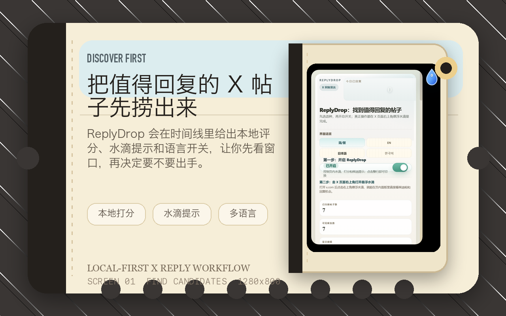
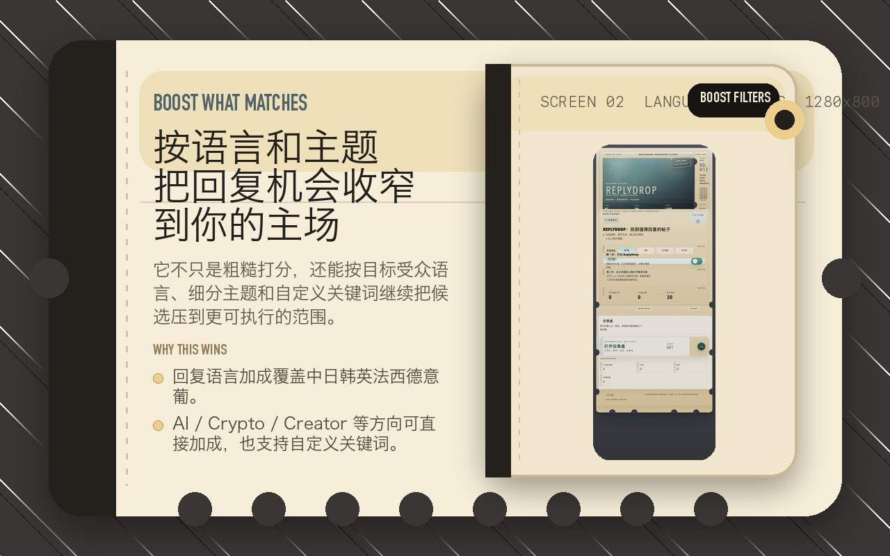
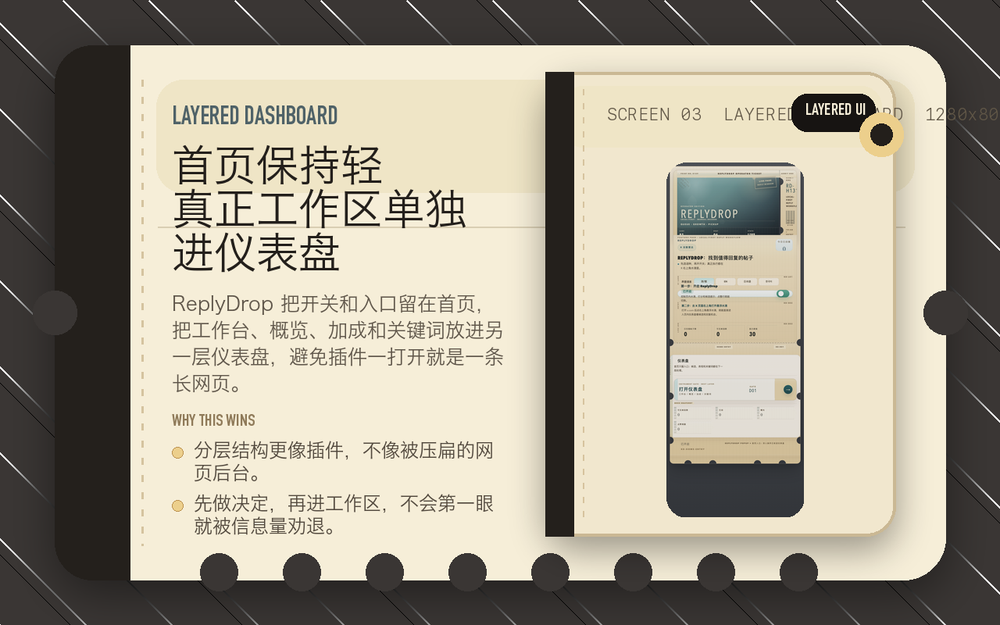
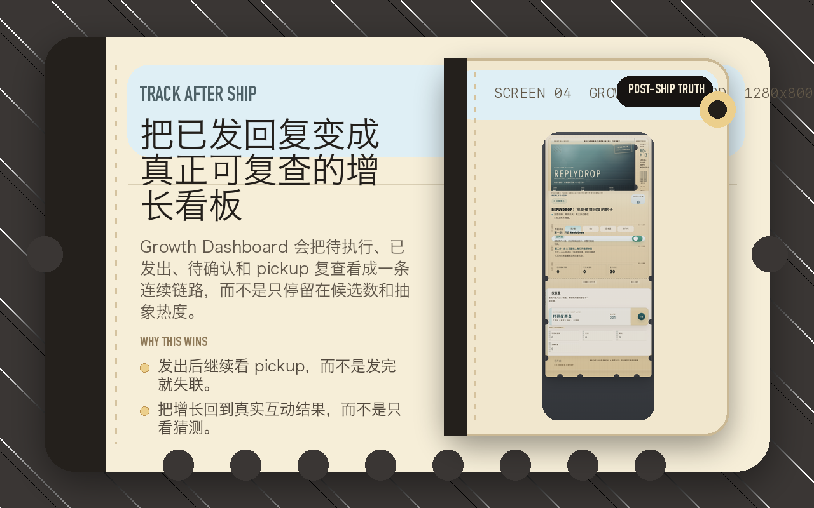
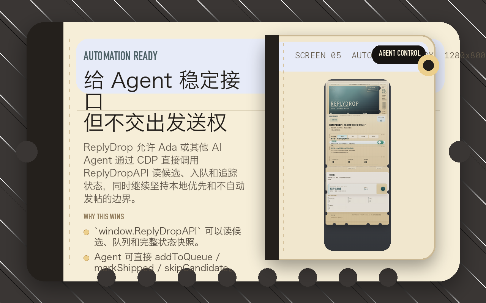
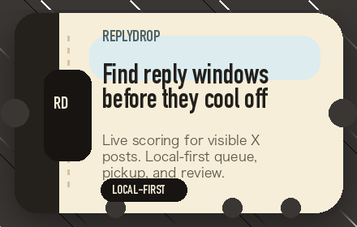
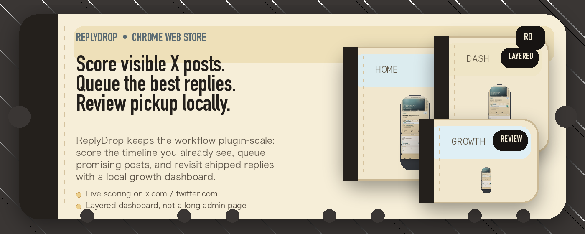

# Chrome Web Store Listing

这份文档收的是 ReplyDrop 当前可直接拿去填商店页面的首批门面内容。

更具体的提交字段、权限说明、隐私答卷和 reviewer 测试指引，见 [CHROME-WEB-STORE-SUBMISSION.md](./CHROME-WEB-STORE-SUBMISSION.md)。

## 图标

- 扩展运行时图标：
  - `icons/icon16.png`
  - `icons/icon32.png`
  - `icons/icon48.png`
  - `icons/icon128.png`
- 预览图：
  - `docs/store/replydrop-store-icon-preview.png`


## 商店截图

推荐顺序：

1. `docs/store/chrome-web-store-01-find-candidates.png`
2. `docs/store/chrome-web-store-02-language-boosts.png`
3. `docs/store/chrome-web-store-03-layered-dashboard.png`
4. `docs/store/chrome-web-store-04-growth-dashboard.png`
5. `docs/store/chrome-web-store-05-local-automation.png`











## 促销素材

- Small promo tile (`440x280`)：
  - `docs/store/chrome-web-store-small-promo-tile.png`
- Marquee promo tile (`1400x560`)：
  - `docs/store/chrome-web-store-marquee-promo-tile.png`
- Promo video poster：
  - `docs/store/replydrop-chrome-web-store-promo-poster.png`
- Promo video source（上传到 YouTube 非公开后，把链接填进商店表单）：
  - `docs/store/replydrop-chrome-web-store-promo.mp4`





## GitHub 门面补充

- GitHub 首页 hero：
  - `docs/assets/replydrop-github-hero.png`
- GitHub demo loop：
  - `docs/assets/replydrop-github-demo-loop.gif`

## 一句话卖点

实时给 X 时间线上的帖子打分，帮你在窗口关闭前找到最值得回复的机会。

English one-liner:

Score visible X posts locally and find reply-worthy windows before they close.

## 短描述

开源免费，本地运行，零数据上传；实时给 X 帖子打分，并用本地队列和 pickup 追踪管理回复机会。

English short description:

Open-source, local-first, zero-upload reply scoring for X, with a local queue, pickup review, traffic signals, and agent-ready automation APIs.

## 详细描述

ReplyDrop 是一个浏览器扩展，实时给你 X 时间线上的每条帖子打分，帮你在窗口关闭前找到最值得回复的机会。

它开源免费，本地运行，零数据上传，不收钱，不依赖任何外部服务。核心目标不是做网页后台，也不是做无人值守批量发帖工具，而是把“先发现值得回复的帖子，再决定什么时候跟进”这件事做得更稳、更清楚。

当前版本重点提供这些能力：

- 在 X 页面实时打分，并用水滴提示高价值回复机会
- 界面支持简体中文、繁體中文、English、日本語、한국어
- 回复语言加成覆盖中日韩英法西德意葡，帮助你匹配目标受众
- 主题关键词加成支持 `AI` / `Crypto` / `Creator` 等细分方向，也支持自定义关键词
- 完整的本地回复队列 + pickup 追踪，发出后自动复查互动结果
- `window.ReplyDropAPI` 让 AI Agent 可以通过 CDP 直接接管候选筛选、排队和追踪流程
- 分层仪表盘把首页入口、工作台和设置区拆开，避免把插件做成一条又长又挤的面板
- Growth Dashboard 把已发回复、待确认与 pickup 复查看成真正的增长看板

ReplyDrop 当前坚持几个边界：

- 本地优先，不依赖云端账号系统
- 不要求登录 ReplyDrop 自己的服务
- 不调用远端 AI API
- 不会在后台无人值守批量发帖；只有显式本地操作或本地自动化调用时才会提交当前回复

如果你想要的是一个更接近 ReplyWisely / Hypefury / TweetHunter / Typefully 工作流节奏，但仍然保留浏览器插件轻量感与可解释状态的工具，ReplyDrop 会是一个更容易上手的替代方案。

## Full Description In English

ReplyDrop is a local-first browser extension for X. It scores posts that are already visible in your current timeline, highlights reply-worthy windows with a compact score marker, and helps you organize replies before the opportunity fades.

ReplyDrop is open source, free, and local-first. It does not require a ReplyDrop account, does not call a remote AI model, and does not upload timeline data to developer-owned servers. Workflow state is stored locally in `chrome.storage.local`.

Current capabilities include:

- Local scoring for visible posts on `x.com` / `twitter.com`
- Multilingual UI: Simplified Chinese, Traditional Chinese, English, Japanese, and Korean
- Language boosts for Chinese, Japanese, Korean, English, French, Spanish, German, Italian, and Portuguese audiences
- Topic and keyword boosts for areas such as AI, crypto, creator work, and custom niches
- Local reply queue, publish watch, pickup review, attribution memory, and growth dashboard
- Traffic-aware scoring using visible engagement and captured X GraphQL traffic signals where available
- `window.ReplyDropExecutor` / `window.ReplyDropAPI` for local agents and CDP scripts to read shortlists, inspect context, fetch media references, refresh recommendations, open the real reply composer, submit, verify, mark shipped, or skip

ReplyDrop is intentionally not a cloud CMS or unattended mass-posting service. It helps users and local agents make better reply decisions while keeping the final action explicit, local, and inspectable.

## 隐私说明

适合直接填写商店隐私摘要的版本：

ReplyDrop 只会读取你在 `x.com` / `twitter.com` 页面里已经渲染到浏览器中的公开内容，例如帖子文本、作者 handle 与可见互动数。所有工作状态默认保存在浏览器本地的 `chrome.storage.local`，当前版本不会把这些内容上传到 ReplyDrop 自己的服务器，不要求外部账号登录，不调用远端 AI API，也不会在后台无人值守替你批量发布。详细边界见仓库根目录的 [PRIVACY.md](../../PRIVACY.md)。

## 重新生成素材

如果后续 UI 更新，需要重做图标和商店图，可以在仓库根目录运行：

```bash
python3 scripts/generate-store-assets.py
```
